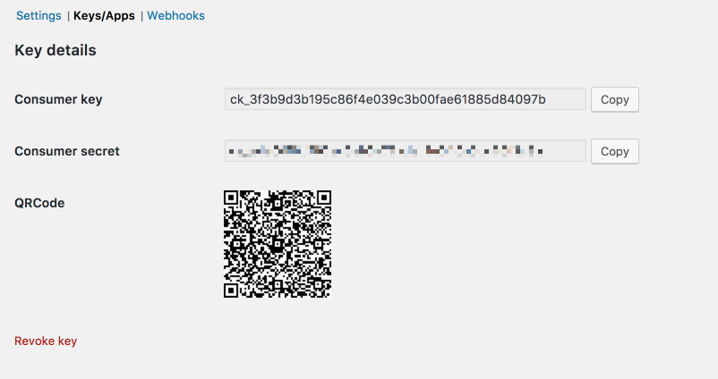
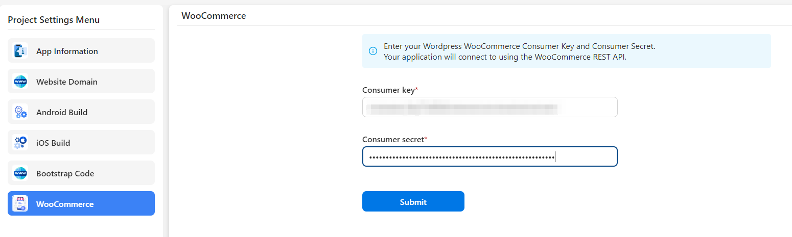

# Appfast builder - The Fastest & Simplest way to create applications

Appfast builder is a Wordpress Plugin allow to build a mobile native app inside your Wordpress website. You can convert your existing Wordpress site to a news app or WooCommerce site to an e-commerce app.

With Appfast builder, you can turn your ideas into reality with website and native apps for both Android & iOS in a matter of minutes.

## 🎉️ Key Features

🚀️ No required Coding skills for everyone.

🚀️ Website and Android + iOS Native App.

🚀️ Push Notification.

🚀️ High performance & Stable App.

🚀️ Many screen layouts for your choice, and you can also make more...

🚀️ Awesome Support.

## 🎉️ Flexible design

You can add, remove, and rearrange blocks in your app with the click of a mouse. Each block comes with custom options for colors, styles, and more.

## 🎉️ Cross platform

Your apps will be built on top of React Native, provide full native interfaces and performance on iOS, Android, Website, PWA (Progressive Web Apps).

## 🎉️ Create faster

Appfast Studio is a no-code platform that lets you visually develop apps, All-in-one solution - Everything you need to build and complete your app, simplified for effortless development and success

## 🎉️ Custom design

Choose from stunning templates specifically designed to have a good-looking, professional with mobile and tablet responsive design.

## 🎉️ Build application

Request to Appfast's Builder Cloud to build a standalone app with your certificate key and get ready to submit to the App Store and Google Play.

## 🎉️ Build-in backend

Appfast's Builder Cloud will handles all servers, database, coding and app performance. You can also customize the backend to suit your needs.

## 🎉️ App categories

Choose from stunning templates specifically designed to have a good-looking.

## 🎉️ WooCommerce

If you already installed WooCommerce plugin in your WordPress site and want to create your own e-commerce app, you can use WooCommerce REST API by input your consumer key and secret in Appfast Builder.

To start using REST API, you first need to generate API keys.

* Go to *WooCommerce > Settings > Advanced*
* Go to the *REST API* tab and click *Add key*.
* Give the key a description for your own reference, choose a user with access to orders etc, and give the key *read/write* permissions.
* Click *Generate api key*.
* Your keys will be shown – do not close this tab yet, the secret will be hidden if you try to view the key again.

Then, copy and paste the consumer key and secret in Appfast Builder.

## 🎉️ Get in touch with us

Whether you have a question about features, trials, pricing or anything else, our team is ready to answer all your questions

👀️ <support@appfast.io>
