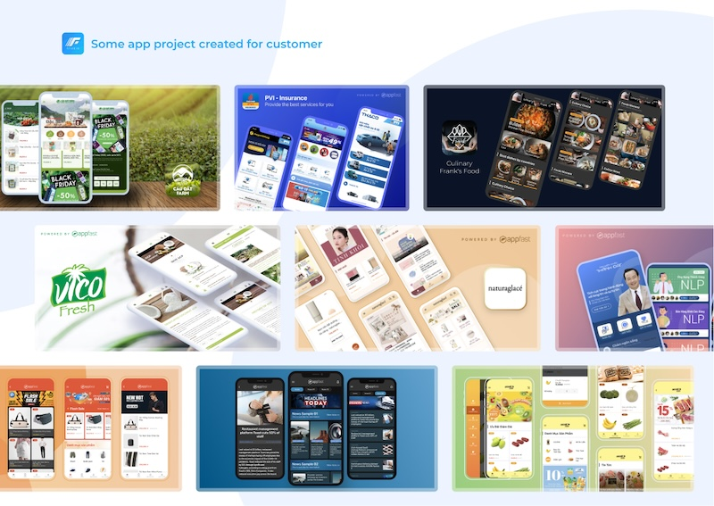
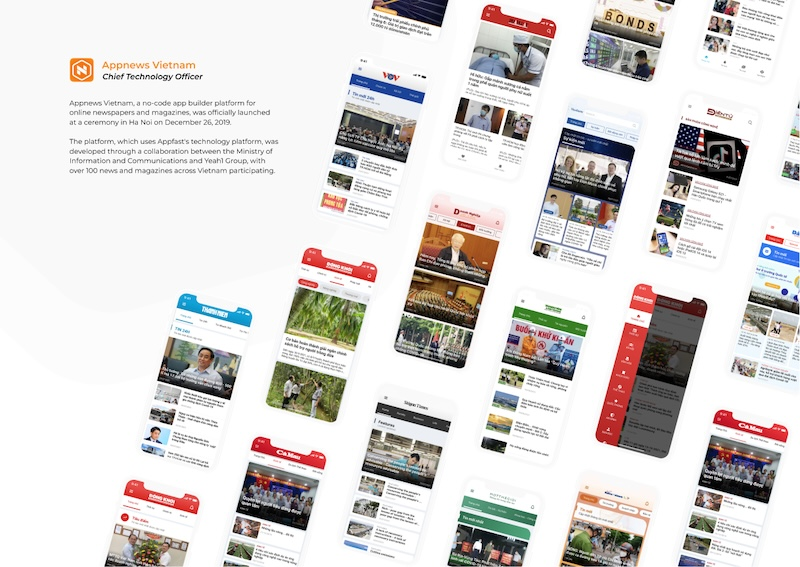
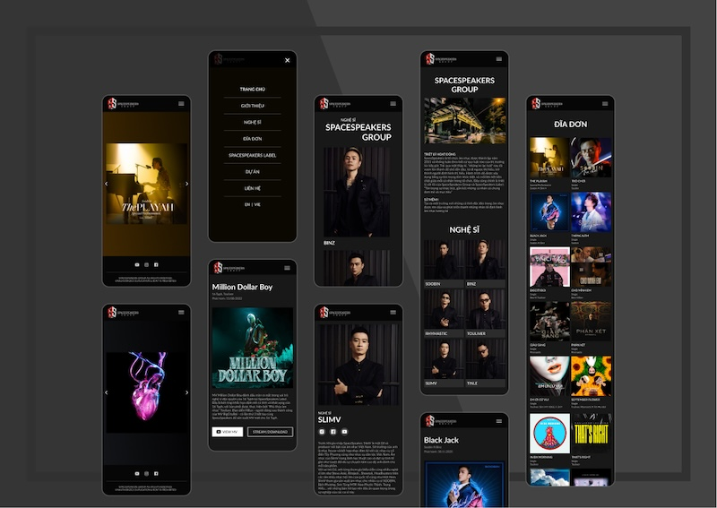
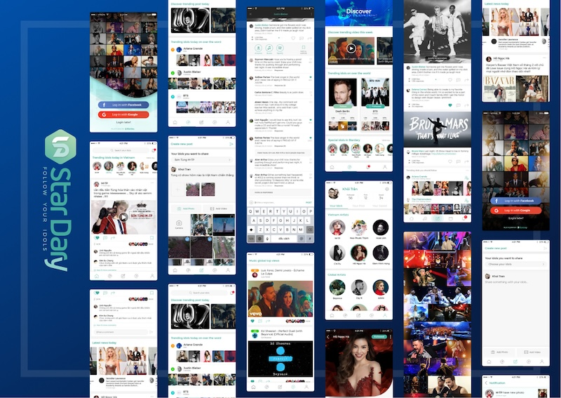

# FastMart WooCommerce - React Native E-commerce Full App

Welcome to the **FastMart WooCommerce**, a versatile and powerful solution created by **Appfast Studio** designed to accelerate your app development process. With FastMart, users can quickly and easily customize every aspect of their app, from UI to features, and export it seamlessly to React Native code.

FastMart WooCommerce is the Full React Native Application that creates iOS and Android mobile apps for your existing WooCommerce website, compatible with any templates.

* Convert any WooCommerce website into iOS & Android app.
* Easily published on both App Store and Google Play.

> – Version: 1.0.0 – latest React Native v0.74
>
> – Last update: 10 July 2024
>
> – Files Included: Full React Native Source Code (iOS & Android)

**FastMart** leverages the power of WordPress as a headless API, allowing you to manage user data, e-commerce functionality, news content, and more with ease. Setting up is a breeze, and for an even smoother experience, you can connect to **Appfast Cloud Backend**.

**Appfast Cloud Backend** takes care of all server management, databases, coding, and app performance optimization, allowing you to focus on customizing the backend to meet your specific needs.

With **FastMart**, you have powerful app, not only for Wordpress e-commerce, but also for news, marketing, HTML5 Mini app, and more.

In the nutshell, **FastMart** can integrate with:

* Wordpress.

* Blog / News.

* E-commerce.

* HTML5 Mini app.

## Reference links

> Video Intro: [https://www.youtube.com/watch?v=TbidwgVi-yk](https://www.youtube.com/watch?v=TbidwgVi-yk)
>
> Demo: Please download Appfast Studio for [iOS](https://apps.apple.com/vn/app/appfast-studio/id1614592863), [Android](https://play.google.com/store/apps/details?id=io.appfast.studio), then use it to scan below QR code.
> 
>
> PWA: [https://fast-mart.appfast.me](https://fast-mart.appfast.me) (It's also a Telegram mini app)
>
> Company Site: [https://www.appfast.io/](https://www.appfast.io/)
>
> Documents: [FastMart Document](https://docs.appfast.io/blog/envato/appfast-store-docs)

*** Please note that this app is for single vendor.

## Key Features

1. **User-Friendly Customization**
  FastMart empowers users with the ability to personalize their app's appearance and functionality without extensive coding knowledge. The intuitive interface ensures a smooth customization process, enabling you to bring your unique vision to life.

1. **Seamless Integration with WordPress**
  Leveraging WordPress as a headless API, FastMart allows users to efficiently manage data related to e-commerce, news, and more. The setup process is streamlined for convenience, making it accessible even for those new to headless CMS.

1. **Appfast Cloud Backend**
  For those seeking an even simpler solution, the Appfast Cloud Backend offers comprehensive support, managing servers, databases, coding, and app performance. This backend service is highly customizable, allowing you to tailor it to your specific needs, ensuring optimal performance and functionality.

FastMart is a universal e-commerce app inspired by the React Native framework, made by Facebook. With the mission of reducing thousands of hours of business spent on designing, developing, and testing a mobile app, FastMart comes as a complete solution for optimizing to deliver your app to the market with high productivity and cost-efficiency. It could be able to satisfy all of the business requirements including e-commerce functionalities, impressive UX design, and smooth performance on both iOS and Android devices.

If your business has already had the website built based on the WooCommerce website then it is easy to integrate with FastMart in just a few steps, and quickly release the final app to both AppStore and Google Play store. The download package is included the full source code and many related resources (designs, documents, videos…) that help you install in the smoothest way.

Either you are business people with raising sale ambition or developers with faster mobile application creation need, FastMart provides you solutions.

Faster - Smoother - Closer.

## WooCommerce features demo

Here are the different types of products.

In the app demo, you can search for product names and explore them.

* Subscription
* Simple product
* Grouped product
* External/Affiliate product
* Variable product (Colors, sizes...)
* Upload file on product (Fashion)
* Downloadable product (Digital, book stores)
* Appointable product (Booking, spa, salon, clinic...)
* Minimum quantity product
* Out of stock product
* On sale product

## Available Features

**Compatible with WooCommerce site** – create the app on both iOS and Android for any WooCommerce sites. If no website, you can use our built-in Appfast Studio WooCommerce plug-in.

**Instance Synchronization** – from mobile to the server and vice versa, the data will be updated smoothly without waiting for time.

**White-labeling** – support fully custom by getting the full source code package, design assets, free extra API.

**Easy Design by drag-n-drop** – customize easily and quickly the Design of your apps without republishing them to Google Play and Apple Store.

**Great UX design** – multi-level categories (horizontal, menu, side menu, card view, etc.), quick product filter, super smooth checkout flow, searching keyword history, Blog Detail screens- change to difference sexy blog detail news via the config file.

**Flexible Design System** – easy to config the Homepage, Category, Blog with a bunch of built-in blocks: Header Bar, Drawer Menu, Bottom Bar, Slider Banner, Product List, Product Detail, Article List, Article Detail, Title Bar, Shopping Cart, Navigation, Video Player, Store List, etc.

**Flexible Category List** – ability to remap a new multi-category tree that is different from the backend site.

**Advance Product Detail View Config** – with the option to show SafeArea, Image Height, inline Video on Product Detail.

**Subscription, Brands** – usability for WooCommerce subscription products and Brands carousel.

**Push Notification** – via OneSignal, Firebase; Order Status Notifications, In-app notification, history messages.

**Powerful User Settings** – view WishList, Order Tracking, Rate App on app stores, Dark theme, Smart Chat setting, switching languages, enable push notifications.

**Offline Images Caching** – speed up the loading performance with caching image offline method.

## What will you get with regular license?

* Full React Native source code for both iOS, Android apps, and PWA
* You can edit all via source code of FastMart lifetime
* One time purchase, Lifetime upgrade
* Well guide to manually build your iOS & Android apps
* Free [drag-and-drop Appfast Studio](https://www.appfast.io/) tool for:
  * Drag & Drop Design Customization
  * Features Configuration
  * Design & Feature files Download
  * Design Upgrade without Republishing to App Stores
  * Unlimited Push Notifications
  * Unlimited App Editing

## Conclusion

FastMart WooCommerce by Appfast Studio is your go-to solution for rapid, customizable app development. Whether you opt for WordPress integration or the robust Appfast Cloud Backend, FastMart ensures your app has the features and performance needed to succeed. Explore the potential of FastMart and elevate your app development journey today.

## My Customer projects

FastMart's flexibility is showcased through various applications, including:

* **The Coffee Shop E-commerce**

* **uGreen E-commerce**

* **FastNews Portal**

These examples highlight the template's adaptability to different industries, providing a solid foundation for a wide range of app development projects.

