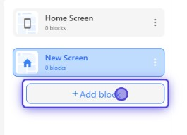
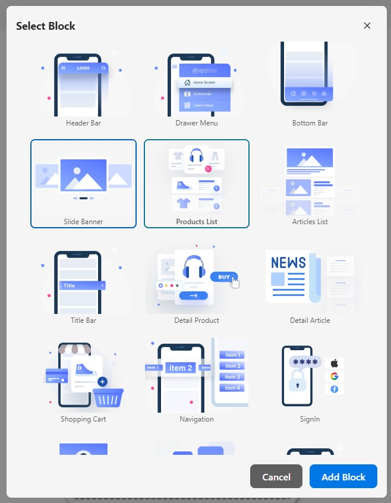

If you want to add a feature to the screen, block is your choice. The block can be configured, renamed, moved up, moved down, duplicated, hidden, deleted and tagged by the user.

You can add new block by selecting the **Add block** button at the bottom of the screen list.

It will open a pop up to show you the available blocks. You can select the block you want to add. The new block will be added to the bottom of the current screen.

## Block common properties

Each block has its own properties and some common ones that are the same for all blocks. You can configure them on the right panel.

### Design

You can select background image or color for the block. You can also select the text color for it in this section.

### Layout - Common

There are some zones on the screen where the block can be placed. It can be customized or referenced from other blocks.

### Hidden On

You can set the block to be hidden on the mobile or desktop devices.

### Custom Block Code

This is the advanced customization for developers area. You can edit the source code of the block or reset it to the default.

### Block Info

| Property | Description      |
| -------- |----------------- |
| Type     | Type of block    |
| Id       | Id of block      |
| Version  | Version of block |
