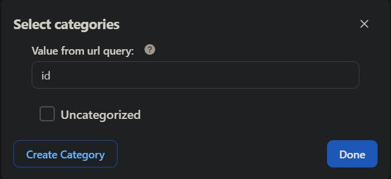

Playlist (Track List) is a block that allows you to display a list of playlists on the screen. It uses the managed playlists in the [Song Playlist plugin](../PLUGINS/song-playlist).

## Common Properties

You can configure the [Block Common Properties](overview#block-common-properties) on the right panel.

## Playlist (Track List) Properties

| Property | Description |
| -------- | ----------- |
| Playlist Filter | Allow you to filter the playlist. You can [filter by track category or tag](#filter-by-track-category-or-tag). |
| Block Skin | Allow you to select the skin of the block. |
| Design | Besides setting the Design in Common Properties, you can also set the color of each item in the block. |
| Text Style | You can customize the look and feel of the texts of each item in the block. |
| Margin & Radius | Allow you to set the block's margins, padding, and radiuses. |
| Elements | Allow you to show/hide the elements of each item. |

### Filter by track category or tag

Here you can select some specific categories or tags to filter the data, such as "Hot songs", "Popular songs", "Latest songs", "Most views songs", etc.

You can also input the name of the category property or tag property.

For example, if you want to show "Most views songs" and filter the data by category ID, you can select "Most views songs" and input `id` as the name of the category property. If you want to filter the data by tag name, you can input `name` as the name of the tag property. Then, you can link the category ID or tag name value to a menu item to display that category or tag on the screen along with the "Most views songs" list.
