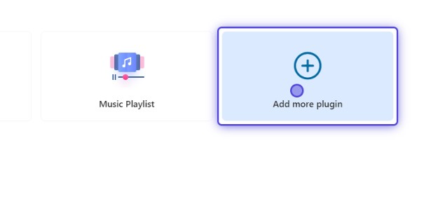

On backend tab you can manage your installed plugins. Each plugin has a specific configuration, so you can configure it.

There are some based plugins already installed on your app. There are [User Management](../PLUGINS/user-management) to manage your users. [WP Hybrid](../PLUGINS/wordpress-hybrid) to manage pages and media. [Posts](../PLUGINS/posts) to manage posts.

You can add more plugins to your app and configure them.

