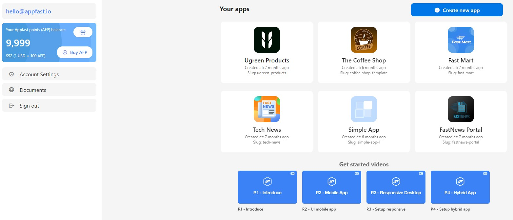
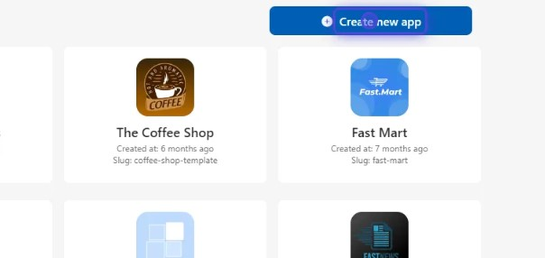
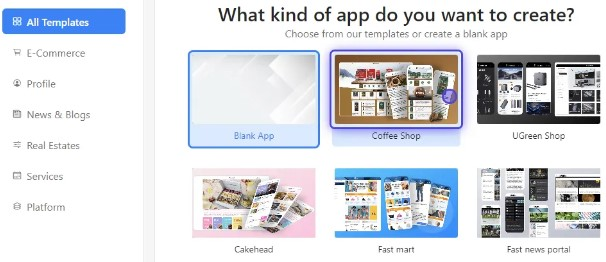
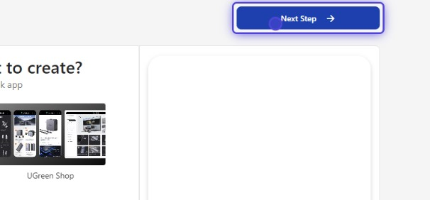
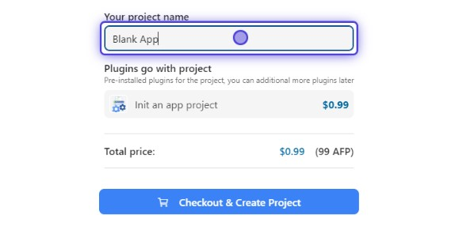
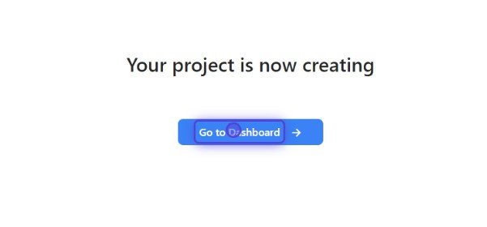

After you sign in successfully, you will be redirected to the dashboard where you can see your apps, find out about new features and improvements, watch helpful videos, and more.

In the dashboard, you can create new apps or edit existing apps.

To create a new app, you can click on the **"Create New App"** button.

Then select the template app that fits your business or start from scratch by selecting the "Blank App".

After that, you can preview the app layout, you can also interact with your app at preview screen.

Next, you can select **"Next Step"** button to continue.

You can give your app a unique name that represents your business philosophy and the brand you plan to build, check the plugins that your template app using and check the template cost before selecting the **"Checkout & Create Project"** button to create your new app.

After your project is created, you can select **"Go to Dashboard"** button to go to the **AppFast** builder.

On next page, you will learn how to build your app in the **AppFast** builder.
