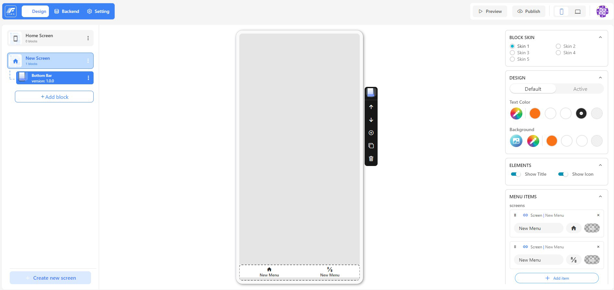
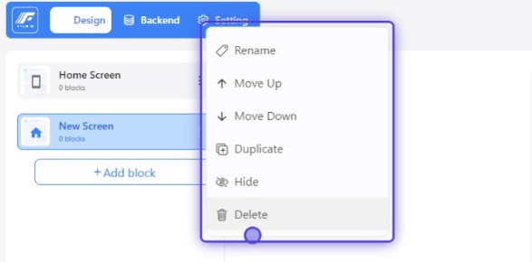

On this Design page, you have tools to edit the application's user interface (UI) as desired. We will have a design screen with the following interface and functions:

There are 3 sections in the design tab:

- Left panel: contains the screen and block list added to the app.
- Middle panel: contains the preview of the app.
- Right panel: contains the settings of the selected screen or block.

On Design page, you can click on "Create new screen" to create a new screen for your app. You can also click on 3-dot button to open a pop up. Here you can rename, move up, move down, duplicate, hide or delete the screen. You can also configure the screen on the right panel.

And then, you can click on the "Add block" button to add a new block. Add block has also the contest menu. Here you can rename, copy, paste, duplicate, hide or delete the block. You can also set the tag color for your block. You can configure the block on the right panel.

The app can be previewed in mobile view or desktop view (It's PWA).
