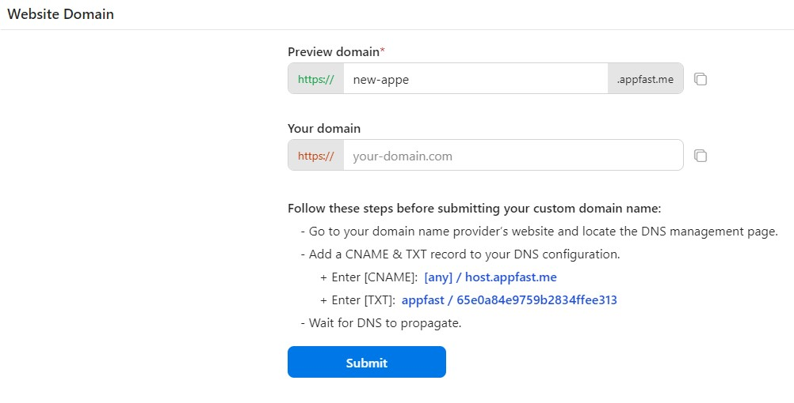
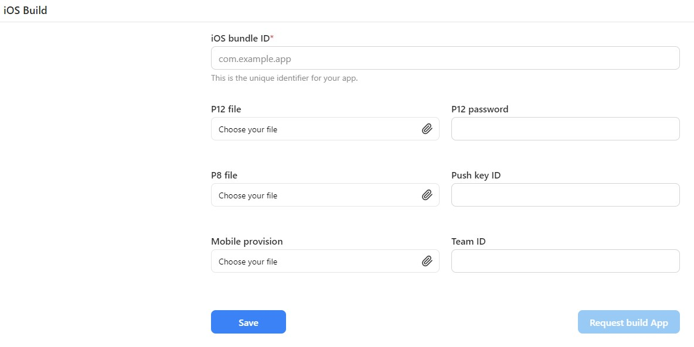
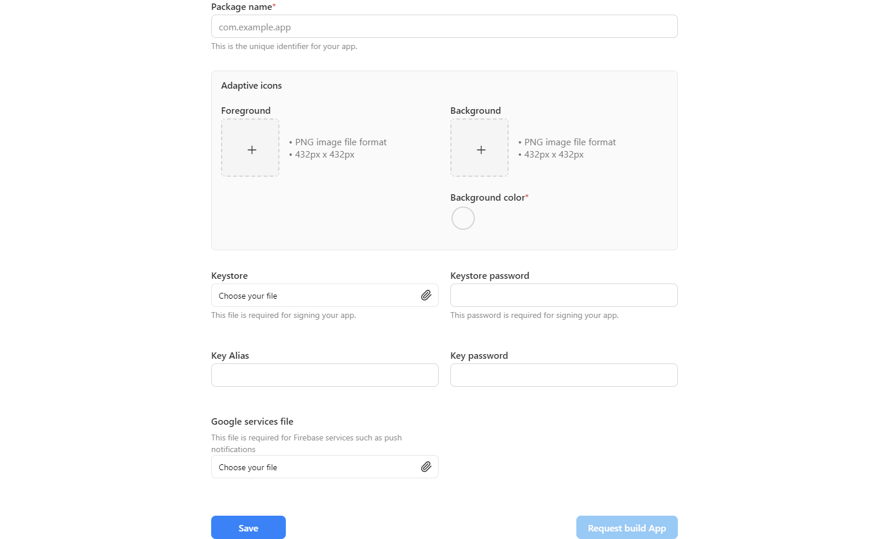
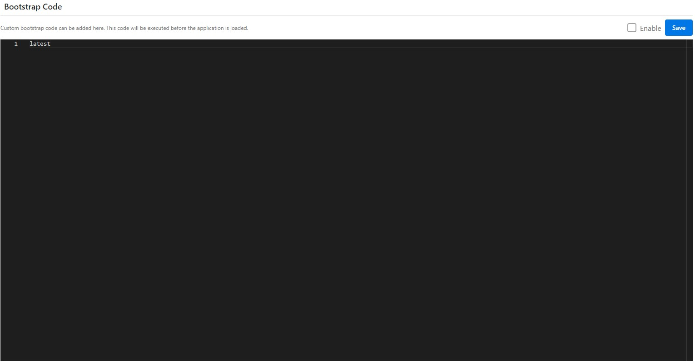

On settings tab, you can configure your app.

In "App Information" menu, you can name your app, upload the splash image, and set the device permissions for the app. You can also delete your app.

You can configure your website (preview and main domain) in "Website domain" menu.

In iOS and Android View menu, you can input the settings of your app from AppStore and PlayStore.

There is a bootstrap code menu where you can input your custom codes. It will be executed before the application is loaded.

You can also request a build for your app.
