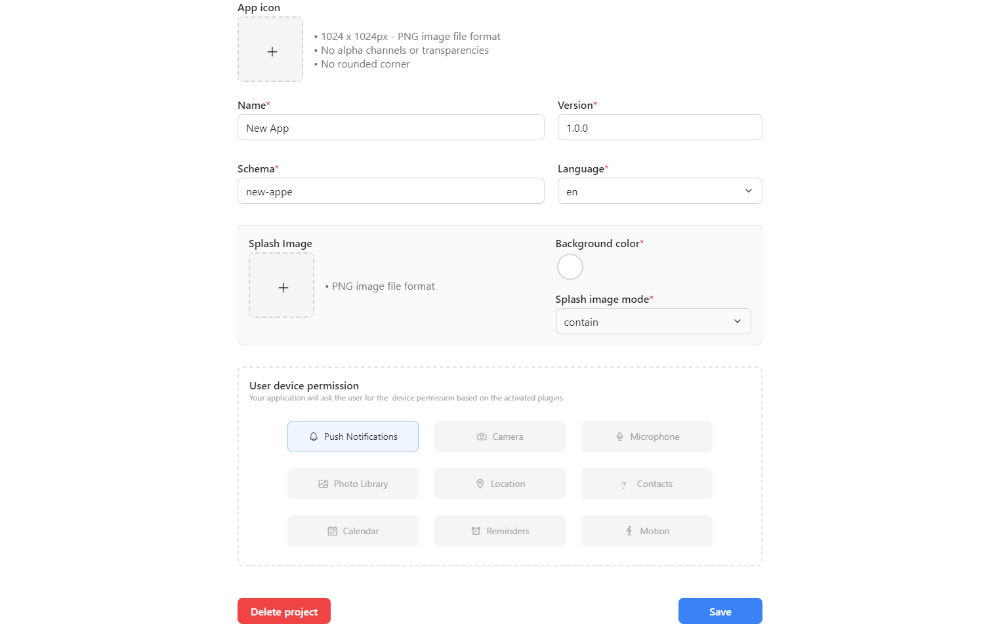

On settings tab, you can configure your app.

## App Information

In "App Information" menu, you can name your app, upload the splash image, and set the device permissions for the app. You can also delete your app.

### Splash Image

A splash image, also known as a launch image, is the image that appears on the first screen a user sees when they open your app. It stays visible while the app is loading.

The default splash image is a screen with a background color set in the `Background color` section. It can be customized using the color picker.

If you set a background color other than the color of your splash image, you may see a difference in the border around it. In this case, you can update it to match your splash image's background color.

Any splash image you provide gets resized to maintain its aspect ratio and fit the resolution of the user's device.

You can use two properties for resizing: `contain` (default) and `cover`. These properties work as demonstrated below:

Applying this to an example:

In the above example, the image is stretched to fill the entire width while maintaining the aspect ratio. This is why the logo on the splash image is larger when `resizeMode` is set to `contain`.

> To learn more about the difference between `contain` and `cover`, see [this blog post](http://blog.vjeux.com/2013/image/css-container-and-cover.html).

## Website Domain

You can configure your website (preview and main domain) in "Website Domain" menu.

## iOS and Android Build

In iOS and Android Build menu, you can input the settings of your app from AppStore and PlayStore.

## Bootstrap Code

There is a Bootstrap Code menu where you can input your custom codes. It will be executed before the application is loaded.

You can also request a build for your app.
