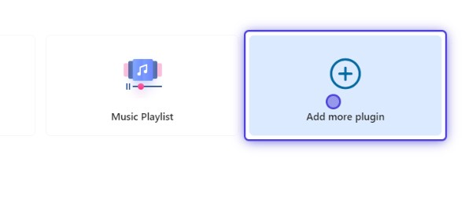
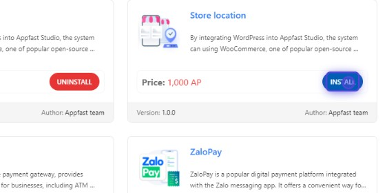
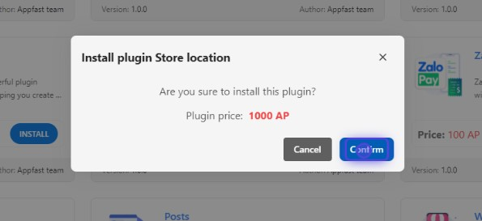
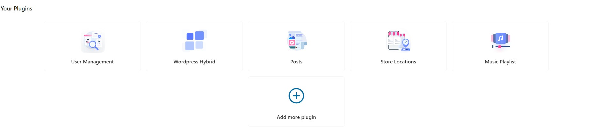
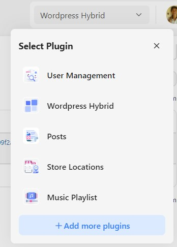

Our builder's core functionality thrives on plugins, effortlessly enhancing its backend capabilities to streamline processes and provide a seamless user experience.

Most of our plugins are based on familiar Wordpress plugins. So, it's easy for you to learn how to use them.

You can also install new plugin to your app by clicking on "Add more plugin" button.

Then, you can click on "Install" button to install the plugin.

A confirmation box will appear. Click on "Confirm" button to install the plugin.

You can click on a plugin on [Backend tab](../GETTING%20STARTED/backend-tab.md) or select from the list on the top of the page to view its details.

