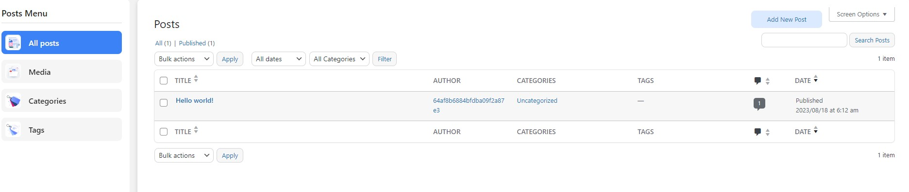

Posts are articles that are organized chronologically, with the newest posts appearing first. You can use various content formats for posts, such as images, videos, galleries, audio, and links. You can manage your posts with this plugin.

By integrating WordPress into **AppFast** Studio, the system now supports various content formats for posts, allowing you to customize how they are displayed. This integration enhances your content management capabilities, making it easier to create engaging and diverse content.

## Image & Gallery Format

Articles with additional images will make the article more prominent and attractive.

Image format is used to display posts with large featured images. Typically, these posts have a prominent image at the top with accompanying text.

The Gallery format allows you to create a post that contains a series of images or illustrations. It automatically generates an attractive image gallery.

## Video & Audio Format

Video & audio make articles lively.

This format enables you to embed videos from services like YouTube or Vimeo directly into your posts. You only need to paste the video link, and WordPress will embed it automatically. For posts containing audio content, you can use the Audio format to embed audio from sources like SoundCloud or direct audio files.

## Quote & Status Format

Short paragraphs make a difference.

This format is used for short text quotes or highlighted quotations. These posts typically feature a distinct quote block. The Link format is used when you want to share a link to an external website. This type of post can contain a link and a brief description.

The Status format is typically used for short updates and brief status announcements, similar to social media status updates. This type is used for short and lightweight posts, often without a title or with only a brief text snippet.
